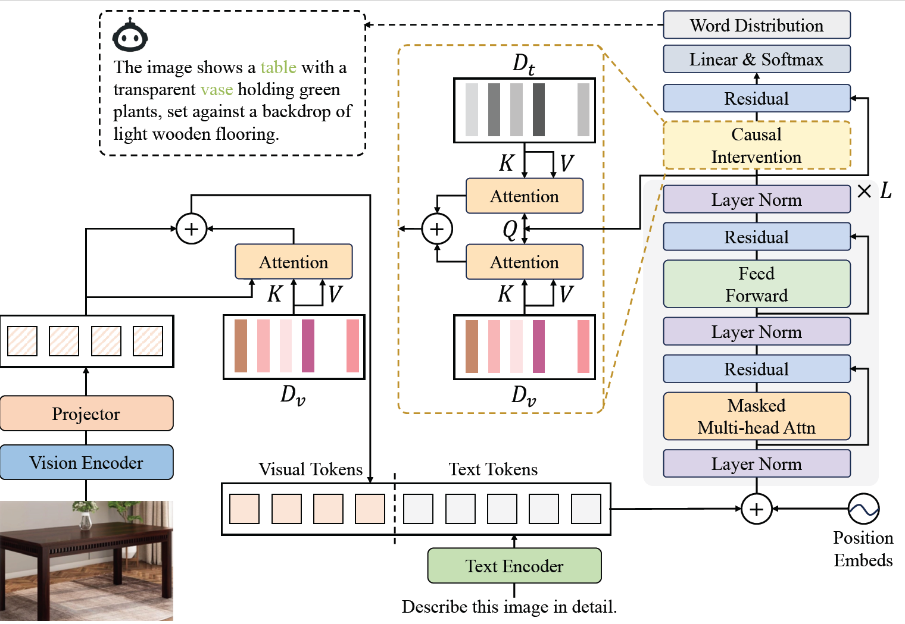
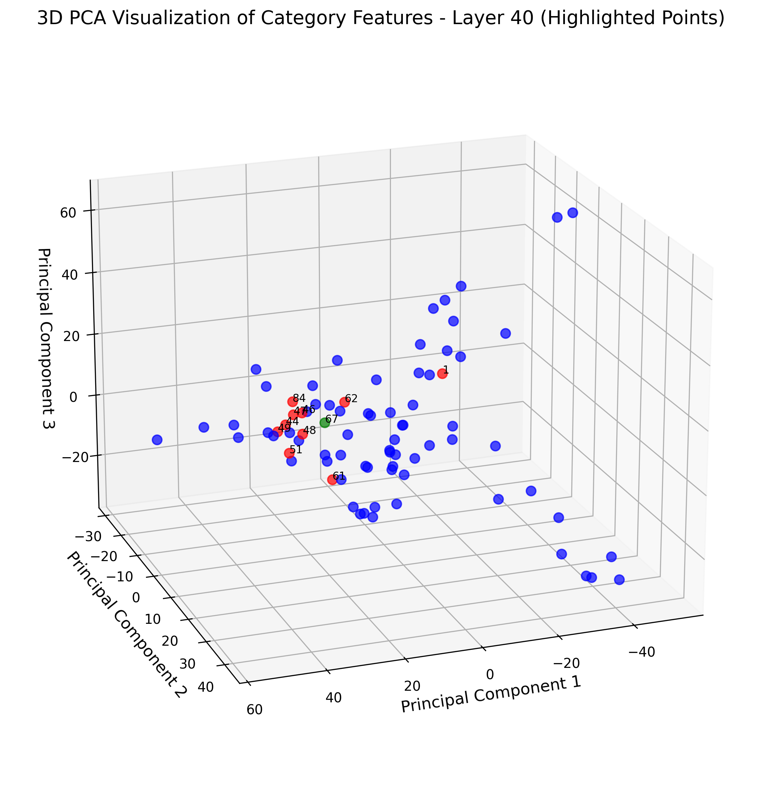
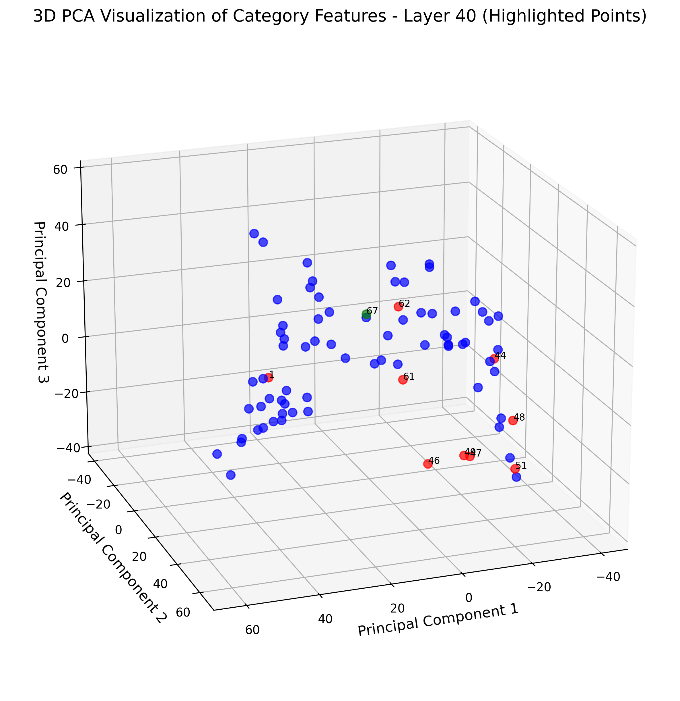
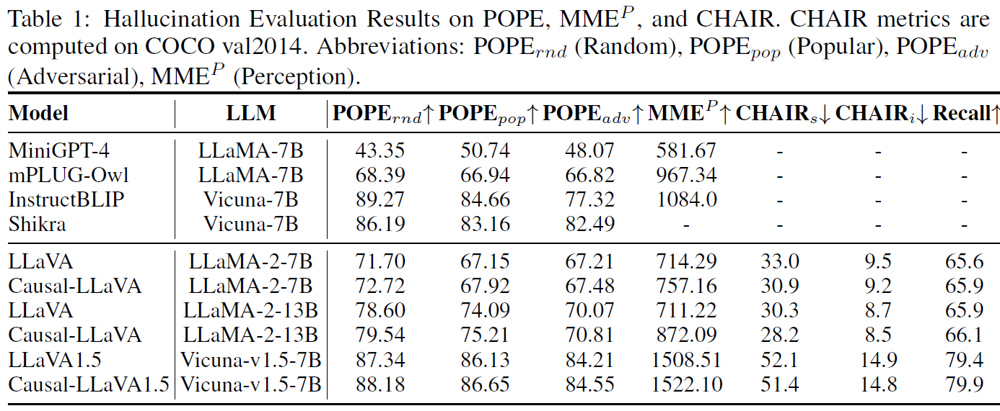

# Causal-LLaVA: Causal Disentanglement for Mitigating Hallucination in Multimodal Large Language Models

[](https://arxiv.org/abs/...)
[](https://github.com/yourname/Causal-LLaVA/blob/main/LICENSE)

This is the official repository for:

> **Causal-LLaVA: Causal Disentanglement for Mitigating Hallucination in Multimodal Large Language Models**  
> Anonymous Authors, NeurIPS 2025 Submission

---

## 🔍 Overview

**Causal-LLaVA** introduces a causality-driven framework to address hallucinations in Multimodal Large Language Models (MLLMs). Our approach disentangles object representations across modalities using causal intervention techniques.

### ✨ Key Components

- **Causality-Driven Projector**: Learns disentangled visual-semantic features by modifying the projection layer.
- **Causal Intervention Module**: Introduced in the final LLM transformer layers to remove spurious correlations across modalities.

<div align="center">
  
</div>

In original LLaVA-13B *(left)*, visual representations (e.g., green: `dining table`, red: top-10 co-occurring objects in llava training data) are highly entangled due to dataset co-occurrence bias.

After causal disentanglement *(right)*, object representations are significantly better separated.

<div align="center">
  
  
</div>


Our method consistently improves performance across various visual understanding benchmarks including hallucination mitigation.

<div align="center">
  
</div>

<div align="center">
  
</div>


## 📚 Abstract

> Multimodal Large Language Models (MLLMs) perform well on visual understanding tasks, but they suffer from object hallucination and generating inconsistent or nonexistent object descriptions due to the dataset biases. 
>
> This paper explores how dataset biases affect object hallucinations in MLLMs on feature space, revealing that biased object co-occurrences lead to entangled semantic representations across modalities. Thus, the model mistakenly activates the representation of an object that often appears with the input object but is absent, leading to hallucinations.
>
>  To address this, we propose a causality-based disentanglement framework using causal intervention to deconfound the biases introduced by frequent object co-occurrences in the data. Specifically, we introduce a Causal-Driven Projector in the visual pathway and a Causal Intervention Module in the final LLM transformer layer, which work together to mitigate spurious correlations. 
>
> Our experiments show a notable reduction in hallucinations while preserving strong performance across several benchmarks, along with visualization analysis confirming improved representation separability. 

---

## 📁 Project Structure


```shell
# Directory Tree
Causal-LLaVA
├── confounders # Estimate and save confounders for visual and text modalities
│   ├── annotations # Sample 5k from the llava_detail_23k dataset to estimate confounders
│   │   ├── COCO-id-name-mapping.json
│   │   ├── detail_5k_bbox_patch_numbers.json
│   │   ├── detail_5k_bbox_patch_numbers_v1.json
│   │   └── detail_5k.json
│   ├── get_projector_confounders.py # Estimate visual confounders for the projector during the pretraining phase
│   ├── get_text_confounders.py # Estimate visual confounders for the projector&LLM during the fine-tuning phase
│   ├── get_visual_confounders.py # Estimate textual confounders for the LLM during the fine-tuning phase
│   └── output
├── docs/
├── images/
├── llava
│   ├── eval
│   │   ├── run_llava.py  # Inference interface, kept unchanged from the original version
│   ├── model
│   │   ├── multimodal_projector # Add causal intervention structure for the projector
│   ├── train
│   │   ├── train.py  # Add confounder loading logic to the training process
│   └── ......
├── modification
│   ├── causal-vicuna-7b-v1.5-init # convert original Vicuna to be compatible with this repository's architecture
│   │   ├── causal-initialization.bin
│   │   └── pytorch_model.bin.index.json
│   └── transformers # Modifications need to be made in the conda environment
│       └── modeling_llama.py # Add causal intervention structure to the LLM Transformer
├── openai
│   └── clip-vit-large-patch14-336
├── scripts
│   ├── confounders
│   │   ├── get_projector_confounders.sh
│   │   ├── get_text_confounders.sh
│   │   └── get_visual_confounders.sh
│   ├── v1
│   │   ├── eval
│   │   ├── finetune.sh
│   │   └── pretrain.sh
│   ├── v1_5
│   │   ├── eval
│   │   ├── finetune.sh
│   │   └── pretrain.sh
│   ├── zero2.json
│   ├── zero3.json
│   └── zero3_offload.json
└── visualization
    ├── output
    ├── pca_all_layers_confounders.py # Visualize visual or text confounders of each layer as PCA 3D scatter plots
    └── pca_projector_confouders.py # Visualize projector confounders as PCA 3D scatter plots
````

## ⚙️ Installation

This repo specifically supports **CUDA 12.x**.

### 1. Clone the Repository

```bash
git clone https://github.com/IgniSavium/Causal-LLaVA.git
cd Causal-LLaVA
```

### 2. Set Up the Environment

```bash
conda create -n causal-llava python=3.10 -y
conda activate causal-llava
pip install -e .
pip install -e ".[train]"
pip install flash_attn-2.6.3+cu123torch2.3cxx11abiFALSE-cp310-cp310-linux_x86_64.whl
```

> ⚠️ The included `flash_attn` wheel is compatible with:
>
> - `CUDA == 12.x`
> - `torch == 2.3.x`
> - `Python == 3.10`
> and can be **downloaded** at [flash-attention releases](https://github.com/Dao-AILab/flash-attention/releases?page=2)

------

## 🧩 Pre-requisites

### Download Checkpoints

- **LLaVA Training Data**: [llava-data](https://github.com/haotian-liu/LLaVA/blob/main/docs/Data.md)
- **CLIP Model**: [HuggingFace - clip-vit-large-patch14-336](https://huggingface.co/openai/clip-vit-large-patch14-336)
- **Vicuna-7b-v1.5**: [HuggingFace - lmsys/vicuna-7b-v1.5](https://huggingface.co/lmsys/vicuna-7b-v1.5)

### Environment Modifications

- Replace `pytorch_model.bin.index.json` in the `vicuna-7b-v1.5` directory with the one provided in `modification/causal-vicuna-7b-v1.5-init/`

- Add `causal-initialization.bin` to that same directory.

- Replace `modeling_llama.py` in your conda env with the modified version from `modification/transformers/`.

  (Possible Path:`miniconda3/envs/release/lib/python3.10/site-packages/transformers/models/llama/modeling_llama.py`)

### Combine json
For now, please merge `confounders/annotations/detail_5k_bbox_patch_numbers_part1.json` and `detail_5k_bbox_patch_numbers_part2.json` into one `detail_5k_bbox_patch_numbers.json` file manually.
We will make the complete annotation folder public on huggingface later.

------

## 🚀 Training

Causal-LLaVA builds upon the LLaVA architecture with brief modifications. Training data, requirements and duration are similar.
 Reference: [Original LLaVA repo](https://github.com/haotian-liu/LLaVA/tree/main)

### 🏁 Pretraining

1. Run `scripts/v1_5/pretrain.sh` until ~0.1 epoch using controlled `--save_steps`.
2. Use the saved checkpoint to estimate projector confounders via `scripts/confounders/get_projector_confounders.sh`.
3. Resume pretraining with full epochs using `--confounders` pointing to the estimated confounders bin files.

### 🎯 Finetuning

1. Run `scripts/v1_5/finetune.sh` until ~0.1 epoch to collect visual/text confounders.
2. Estimate confounders using `get_visual_confounders.sh` and `get_text_confounders.sh`.
3. Resume finetuning with `--confounders` pointed to the confounders directory for full training.

------

## 🧪 Inference & Evaluation

An inference interface is available in `inference.py`.

You can integrate it with original LLaVA evaluation scripts. Refer to: [LLaVA Evaluation Guide](https://github.com/haotian-liu/LLaVA/blob/main/docs/Evaluation.md)

------

## 📊 Visualization

Additional Packages for Visualization:
```bash
pip install scikit-learn matplotlib
```

You can visualize all `xxx_confounders.bin` files using:
```bash
# For projector confounders
python visualization/pca_projector_confouders.py

# For all layers (visual/text)
python visualization/pca_all_layers_confounders.py
```

These scripts render 3D PCA plots for interpretability.

------

## 📄 License

This project is licensed under the [MIT License](https://github.com/IgniSavium/Causal-LLaVA/blob/main/LICENSE).